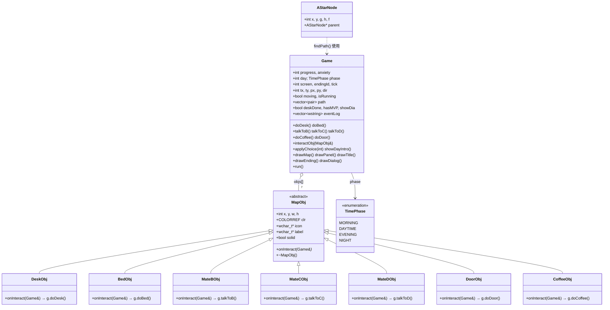

# Deadline 冲刺器 — 类结构与关系

---

## 总览

项目一共 **3 个类 + 1 个枚举**：`MapObj`（抽象基类 + 7 派生）、`AStarNode`（寻路节点）、`Game`（上帝类）、`TimePhase`（时段枚举）。

```
MapObj（抽象基类）          AStarNode（结构体）
  ├─ DeskObj                  int x, y, g, h, f
  ├─ BedObj                   AStarNode* parent
  ├─ MateBObj
  ├─ MateCObj         ⬆ findPath() 使用 AStarNode
  ├─ MateDObj         ⬇
  ├─ DoorObj          Game（上帝类）
  └─ CoffeeObj         ├─ MapObj* objs[7]  ← 组合7个物体
                       ├─ TimePhase phase   ← 时段枚举
                       ├─ 2个核心数值（progress + anxiety）
                       ├─ 玩家位置 + A* 寻路
                       ├─ 每日追踪 + 对话框 + 规则
                       ├─ 7个交互方法 + applyChoice + showDayIntro
                       ├─ 5个绘制方法 + run() 主循环
```

---

## ① MapObj — 抽象基类（可交互物体）

```cpp
class MapObj {
    int x, y, w, h;           // 在地图上的位置和占格（单位：tile）
    COLORREF clr;             // 颜色
    const wchar_t *icon;      // emoji 图标（💻 🛏️ 👤 🚪 ☕）
    const wchar_t *label;     // 中文标签（"电脑桌" "老卷B"…）
    bool solid;               // 是否阻挡行走（true=实体, false=可穿过）
    virtual void onInteract(Game& g) = 0;  // ★ 纯虚函数 — 每个子类重写
    virtual ~MapObj(){}                     // ★ 虚析构 — 保证派生类正确析构
};
```

**作用**：将「什么是物体」和「物体被点击后做什么」解耦。基类只负责外观属性，子类负责交互行为。

### 7 个派生类（每行一个，结构完全一致）

```cpp
class DeskObj   : public MapObj { onInteract(Game& g) → g.doDesk();    };
class BedObj    : public MapObj { onInteract(Game& g) → g.doBed();     };
class MateBObj  : public MapObj { onInteract(Game& g) → g.talkToB();   };
class MateCObj  : public MapObj { onInteract(Game& g) → g.talkToC();   };
class MateDObj  : public MapObj { onInteract(Game& g) → g.talkToD();   };
class DoorObj   : public MapObj { onInteract(Game& g) → g.doDoor();    };
class CoffeeObj : public MapObj { onInteract(Game& g) → g.doCoffee();  };
```

**派生类之间没有直接关系**——它们并列继承 MapObj，互不依赖。加第 8 种物体只需新建一个子类 + 一个 Game 方法，不动任何已有代码。

---

## ② AStarNode — 寻路节点（结构体）

```cpp
struct AStarNode {
    int x, y;          // 节点的地图坐标
    int g;             // 从起点走到这里的实际代价
    int h;             // 到终点的估算代价（曼哈顿距离）
    int f;             // f = g + h — 综合优先级，越小越先探索
    AStarNode* parent; // 父节点指针 — 到达终点后沿着链回溯得到完整路径
};
```

**关系**：被全局函数 `findPath()` 创建和消费。与 Game 没有直接成员关系 — `findPath()` 是独立函数，Game 的 `run()` 调用它并把结果存入 `path` 成员变量。

---

## ③ TimePhase — 时段枚举

```cpp
enum TimePhase {
    MORNING,  // ☀️ 早上 — 写代码效率最高（+15）
    DAYTIME,  // 📖 白天 — 效率中等（+12）
    EVENING,  // 🌆 傍晚 — 效率下降（+10）
    NIGHT     // 🌙 深夜 — 效率最低（+8），触发规则1弹窗
};
```

**影响**：Game 的 `doDesk()` 根据 `phase` 查效率表 `TIME_EFF[]`，决定每次写代码加多少进度。

---

## ④ Game — 上帝类（700+ 行，组合一切）

### 成员变量分组

| 组 | 变量 | 说明 |
|----|------|------|
| **核心数值** | `progress`, `anxiety` | 唯一的两个数值维度，互相制约 |
| **时间** | `day`, `phase`, `screen`, `endingId`, `tick` | 4天×4时段 + 标题/游戏/结局三画面 |
| **玩家位置** | `tx,ty` (逻辑坐标), `px,py` (像素坐标), `dir`, `moving`, `moveDirX/Y`, `moveProgress`, `path`, `targetX/Y` | 支持鼠标点击移动 + A* 寻路 + 走动/跑步切换 |
| **每日追踪** | `codeCount`, `coffeeCount`, `deskDone`, `talkedToB/C/D`, `dayIntroShown`, `hasMVP`, `deskOpened`, `bAskCount` | 记录今天的行动，次日 reset |
| **对话框** | `showDia`, `showChoices`, `diaTitle`, `diaText`, `choices`, `hoverSel`, `hoverCloseBtn`, `pendingCodeEff`, `eventLog` | 对话弹窗 + 选项选择 + 事件日志 |
| **规则** | `warnedRule2` | 规则2（连写3次警告）的已警告标记 |

### 关键方法（按功能分组）

```
交互方法（被派生类的 onInteract 调用）
  ├─ doDesk()      写代码 — 查效率表 + 规则2惩罚 + 深夜规则1弹窗
  ├─ doBed()       睡觉 — Day4不能睡的规则4判定
  ├─ talkToB()     找老卷 — 推进度，被问太多会不耐烦
  ├─ talkToC()     找阿瓜 — 降焦虑（随机金句6选1）
  ├─ talkToD()     找老摸 — Day2解锁buff "先跑通再优化"
  ├─ doCoffee()    喝咖啡 — 规则0空腹惩罚 + 每日上限2杯
  └─ doDoor()      去走廊 — Day4 交作业/结局判定

调度方法
  └─ interactObj(MapObj& o)    ★ 多态核心 — 1行: o.onInteract(*this)
     替代了原来的 7 路 strcmp 分支

叙事方法
  ├─ applyChoice(ci)   处理玩家选项 — 深夜重构/吹牛/睡觉选择的分支判定
  └─ showDayIntro()    每天早上的开场叙事（4天各不相同）

渲染方法
  ├─ drawMap()         绘制 20×20 网格地图 + 7 个物体 + 玩家 + 交互栏
  ├─ drawPanel()       绘制右侧面板 — 数值条 + 室友状态 + 事件日志 + buff标签
  ├─ drawTitle()       绘制标题画面（背景 + 操作说明 + 开始按钮）
  ├─ drawEnding()      绘制4种结局画面
  └─ drawDialog()      绘制对话框（标题 + 正文 + 选项按钮 + 关闭按钮）

主循环
  └─ run()             消息循环 + 每帧逻辑（寻路消费/移动/交互/E键检测）+ 帧渲染
```

### 类间关系总结

| 关系 | 说明 |
|------|------|
| **MapObj ← 7 派生类** | 继承 — `onInteract()` 纯虚函数定义接口，派生类各自实现 |
| **Game ◇→ MapObj*** | 组合 — Game 持有 `objs[]` 指针数组，每帧遍历绘制，点击时调用 `o->onInteract(*this)` |
| **Game → AStarNode** | 使用 — `run()` 调用独立函数 `findPath()`，内部用 AStarNode 构造路径，结果存入 `path` |
| **Game → TimePhase** | 包含 — `phase` 成员变量控制时段流转，`advancePhase()` 负责自动推进 |
| **7 派生类 → Game** | 依赖（反向调用）— 每个 `onInteract(Game& g)` 通过 `g.doXxx()` 反向操作 Game 状态 |

### 设计亮点

```
★ 交互多态:     o->onInteract(*this) — 1 行替代 7 路 strcmp 分支
★ 只用 2 个数值: 所有行为最终只改 progress 和 anxiety — 约束激发设计
★ 规则耦合在对话里: 规则不是弹窗，是室友的反应 — 玩家自己发现
★ 时段影响效率:    TIME_EFF[] 查表 — 鼓励白天写、惩罚深夜硬撑
★ 先跑通再重构:    第一版 strcmp 分支写完，功能稳定后才引入多态继承
```

